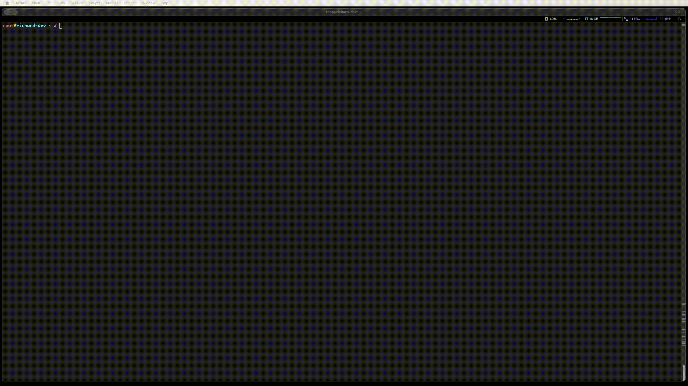

# staking-batch-depositer

## Overview
This Node.js script facilitates the processing of Ethereum deposit data. It reads deposit data from a `deposit-data.json`, interacts with an Ethereum deposit contract, and executes deposit transactions. The script includes features like environment variable-based configuration, transaction locking to prevent double processing.





## Features
- Processes deposit data from a specified file.
- Connects to Ethereum nodes via JSON-RPC using the ethers.js library.
- Handles deposit transactions with a given Ethereum deposit contract.
- Utilizes environment variables for secure configuration.
- Implements a locking mechanism to prevent duplicate transactions.

## Requirements
- Node.js
- npm (Node Package Manager)
- An Ethereum node accessible via JSON-RPC
- A funded Ethereum wallet

## Installation
Ensure Node.js and npm are installed on your system. Then, install the required dependencies using npm:

```
git clone https://github.com/OpenFusionist/staking-batch-depositer.git
cd staking-batch-depositer
npm install
cp .env.example .env
```

### Configuration
Set up the .env file in the project root, based on .env-example. Configure these variables:

- `PROVIDER_URL`: URL of the Ethereum JSON-RPC node.
- `PRIVATE_KEY`: Private key of your Ethereum wallet.
- `CONTRACT_ADDRESS`: Address of the Ethereum deposit contract.

For transaction configuration, set (optionally):

- `GAS_LIMIT`: Maximum gas for transactions.
- `GAS_PRICE`: Gas price in Gwei.

### Usage
Run the script with a file containing deposit data as an argument:

```
node batchDeposit.js <file_path>(eg.deposit_data-xxx.json)
```

The script will:
1. Read deposit data from the provided file.
2. Connect to the Ethereum network.
3. Process each deposit entry:
   - Check for an existing lock file.
   - Create a transaction with deposit details.
   - Send the transaction to the network.
   - Create a lock file on successful transaction sending.
4. Log transaction details and errors.

### File Format
The script expects a JSON file with an array of deposit data objects. Each object should include:
- `pubkey`
- `withdrawal_credentials`
- `amount`
- `signature`

### Locking Mechanism
To prevent processing the same deposit data multiple times, the script uses a locking mechanism:
- Checks for a `.lock` file associated with each `pubkey`.
- Creates a `.lock` file after successfully processing a transaction.

### Disclaimer
This script is for educational and development purposes. Test thoroughly in a safe environment before production use. Secure your private key and sensitive details.

### License
MIT

### Contributing
Contributions are welcome. Please follow standard coding practices and submit pull requests for enhancements or fixes.
